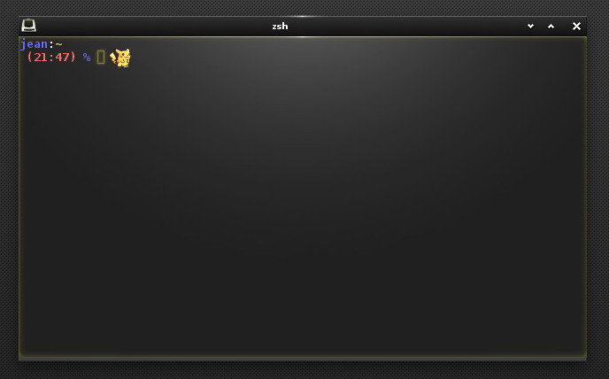
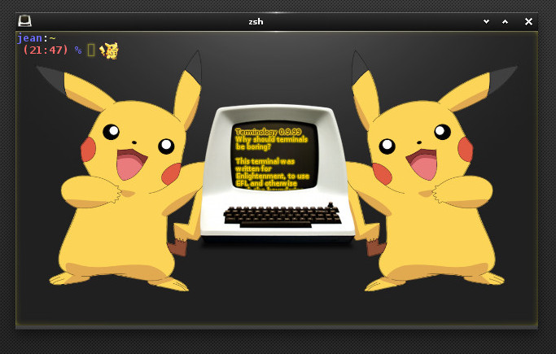
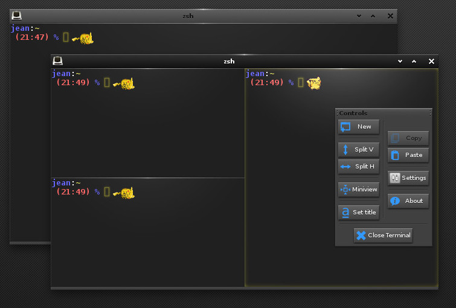
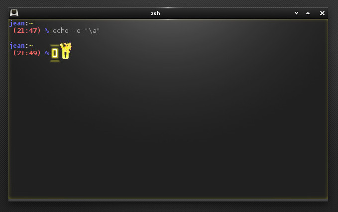
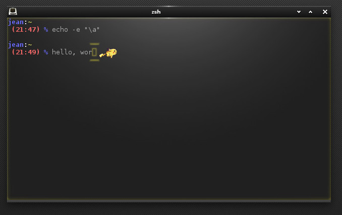

# pikalogy

## Pikachu theme for Terminology

[Terminology][2] is a genius terminal emulator developed by the [Enlightenment
Foundation][1]. On top of being quite fast, it also proposes a new range of
customization that is only limited by one's imagination.

This Pikachu theme for Terminlogy has been inspired from the [nyanology theme
from Anisse Astier][3].

Note that this is completely unaffiliated with [Nintendo][5] or [The Pokemon
Compagny][4]... this is just a fan theme made for fun I'm not searching for
trouble (to make it double).

## Usage

* Make sure terminology is installed (see download link above)
* In the directory of the pikalogy theme:
  * `make DEFINITIONS="your definitions"` to compile the Edje file with options
    among:
    * `-DWITH_SOUND` to unable sound effects (DISABLED BY DEFAULT)
  * `make install` (as root if necessary) to install the files.
  * You can override the `PREFIX` variable to change the destination of the
    installed files.
  * `make uninstall` (as root if necessary) to remove installed files.
* In terminology, right-click, select ‘‘Settings’’ then ‘‘Theme’’ and chose
  ‘‘pikalogy’’
* In Settings/Behaviour don't forget to check the boxes ‘‘React to key
  presses’’, ‘‘Visual Bell’’ and ‘‘Cursor Blinking’’ for the best effects.

## Screenshots

## Known Limitations

I do not dedicate much time to this theme, but gladly accept [pull
requests][6]! Below is a (non-exhaustive) list of what does not work
or needs love:

- [ ] The cursor underline and cursor bar features are not implemented.
- [ ] Miniview is broken?

## Credits

* Pikachu sprites: http://boomchica.deviantart.com/art/Pikachu-Sprite-Sheet-203643477
* Terminology is Copyright 2012-2019 Carsten Haitzler and others.

## License

The MIT License (MIT) only applies to the modifications I made to the default
theme of Terminology, not to the original file nor source code or icons
belonging to Terminology.  See `LICENSE.md` for details.

[1]: https://www.enlightenment.org
[2]: https://www.enlightenment.org/about-terminology
[3]: https://github.com/anisse/nyanology
[4]: https://www.pokemon.com/us/
[5]: https://www.nintendo.com/
[6]: https://help.github.com/en/articles/creating-a-pull-request
